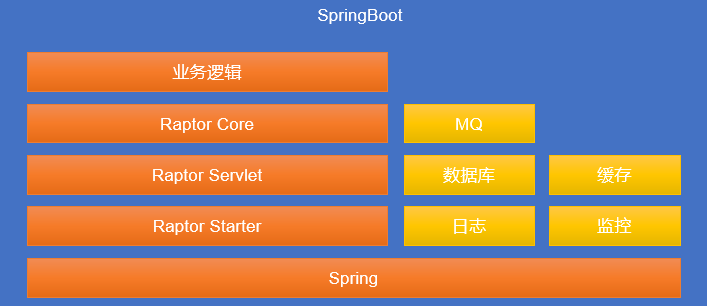
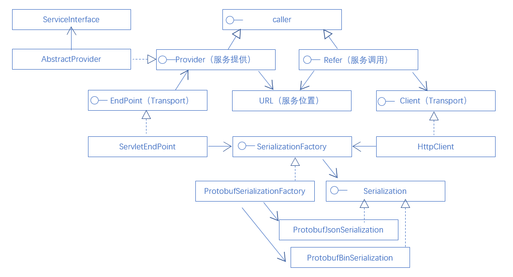

# 拍拍贷微服务体系

拍拍贷微服务体系是拍拍贷基础框架部总结内部微服务多年实践，参考、吸收大量业内解决方案形成的适合中型互联网公司的微服务解决方案。

拍拍贷微服务体系主要组成部分：
- Raptor rpc框架。
- Radar服务注册中心。
- Kong网关。

拍拍贷微服务体系的总体调用关系图：

微服务实例启动之后，会自动注册到radar服务注册中心，实例启动正常后，kong网关周期性的将实例信息同步到kong的插件配置。微服务之间的调用、zuul网关调用微服务，都是通过域名进行调用，域名解析到kong网关。Kong网关根据域名和微服务的对应关系，对微服务实例进行负载均衡运算后，得到一个实例，最终进行调用。

拍拍贷微服务体系主要架构考虑：
- 由Kong网关形成的集中式服务治理。降低由于客户端服务治理bugfix等引起的升级成本。
- 采用HTTP 1.1作为底层传输协议，从外部到内部无需进行协议转换。
- 采用HTTP 1.1 作为底层传输协议，不会引起原有基于HTTP协议的已有设施失效。

# Raptor微服务rpc组件

Raptor微服务rpc组件是拍拍贷基础框架部参考、借鉴了大量已有rpc框架、rpc组件的设计，研发的一款基于google protobuf的轻量级，可扩展的rpc组件。

**Raptor设计理念：**
- 微内核。Raptor核心实现raptor rpc必须的服务定义、protobuf序列化/反序列化、扩展接口和最小化实现。
- 可扩展。Raptor核心预留了Client、Endpoint等可扩展接口，提供相应的实现即可替换掉默认的实现。
- 模块化。Raptor核心不提供组装能力，raptor核心提供了rpc框架所需的核心组件，由外部框架进行组装。例如，raptor默认实现提供了基于spring-boot的组装方式。

**Raptor的价值：**
- 契约驱动开发模式，以protobuf为契约，帮助企业规模化生产。
- JAVA语言开发，工程性好，保护原有技术投资。
- 预留兼容性，以protobuf为契约，符合社区技术趋势，为后续以protobuf为基础做技术升级留下兼容性。例如，引入grpc，业务契约无需改变。
- 灵活性，可采用集中治理，也可以采用客户端治理；可使用protobuf binary over HTTP也可以使用protobuf json over HTTP，服务提供方根据HTTP头自适应；为架构师留下灵活的选择余地。

**Raptor的总体架构：**

Raptor框架的通讯协议采用HTTP 1.1协议，对外暴露的是HTTP接口，只支持POST方法。默认使用单独的Servlet注册到spring-boot方式，使用不同的路径和其他RESTful接口的Servlet进行区分。

raptor starter基于spring-boot提供自动配置、自动装配能力进行组装，使raptor形成框架开箱即用。

raptor的核心是raptor core，raptor core实现了核心的服务定义、序列化反序列化、服务调用能力，供外围的框架组装使用。

**Raptor的核心类图：**

# 参考文档
请参考[wiki](../wikis/home)