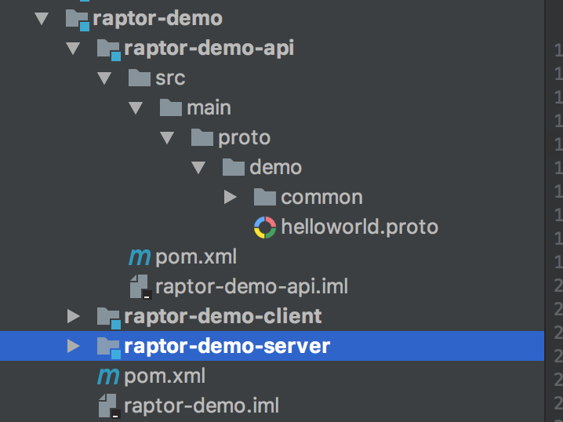

# 最佳实践

Raptor是一个基于契约的RPC框架,这使得在契约定义好之后,你不必再关心方法路由,参数转化等问题.但仍然有一些细节值得考究.

## 项目结构

如下是推荐的项目结构:


有如下注意点:
 1. 将`.proto`文件和他们声称的文件放在一个单独的模块中.
 2. 不要讲接口的定义和接口的实现放在一个模块中,这样别人就能引用一个干净的接口.

## `.proto` 文件
`.proto`文件作为契约,是整个RPC的中心,所有数据结构和接口定义都由`.proto`文件决定.
1. 开发的第一步就是定义`.proto`文件.由于`.proto`文件真的**十分重要**,请在实现功能之前,仔细讨论`.proto`的设计.
2. 使用proto3,而不是proto2.请在`.proto`的头部加上`syntax="proto3"`.
3. 请**不要**使用`java_package`来定义Java包名,这会使得一些地方的包名不统一,进而引发一些bug.
4. 在`.proto`中加上注释.`.proto`文件中的注释可以被解析到,今后我们会利用`.proto`文件直接生成文档,这时注释就十分有用了.
`.proto`的头部应该是如下的样子:
```
syntax = "proto3"

package <organization>.<repo>.<service>;
```

## 命名规范
和其他API一样,保持命名的简单直观和无二义性是十分重要的.

根据[Protobuf的命名规范](https://developers.google.com/protocol-buffers/docs/style):

* 使用首字母大写的驼峰命名法(`CamelCase`)为`Service`,`Message`和`Type`命名
* 使用小写下划线分割命名法(`underscore_separated_names`)为字段命名
* 使用大写写划线分割命名法(`CAPITALS_WITH_UNDERSCORES`)为枚举命名
* 与命名规范**不符**的是,我们建议使用首字母小写的驼峰命名法(`CamelCase`)为方法命名


[Google Cloud Platform design guides ](https://cloud.google.com/java/docs/tutorials/bookshelf-on-kubernetes-engine)是很好的参考,简而言之:
* 相同的概念使用相同的命名
* 避免让名称承载过多概念,不同的概念使用不同的命名
* 在时间或者数量等概念后加上单位,例如`delay_seconds`


## 默认值和必填字段
Proto3 不能设置默认值,所有字段都有默认的默认值,可以参考[Proto3默认值](https://developers.google.com/protocol-buffers/docs/proto3#default):
| 类型    | 默认值    |
| :------------- | :------------- |
| string      | ""    |
| btye  | 空byte  |
| bool   |false   |
| 数字   | 0  |
| enum   | 第一个枚举值  |
| message   | null   |

> message 的默认值和语言有关, 在java中的默认值是null

在proto3语法中,所有的字段都是可选择的,都不是必须的.所以当你需要使某个字段是必填时,你需要在服务的实现中规定这一行为.同样的,如果你需要为某个字段设置特殊的默认值,你也需要在服务实现中规定这一行为.另外你也不能分辨出"空字段"和"消失的字段".
>在`{"name":"Alice","age":null}`中age是"空字段",而在`{"name":"Alice"}`中,age是"消失的字段"
