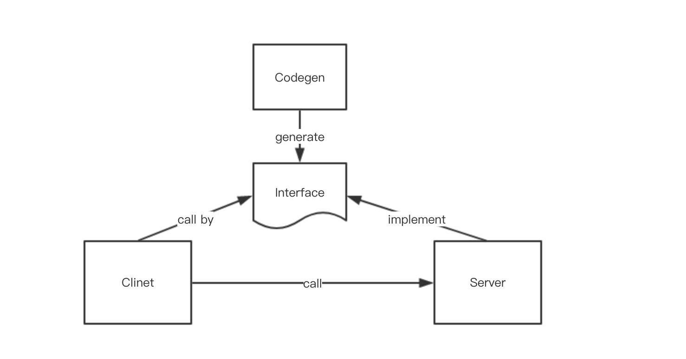
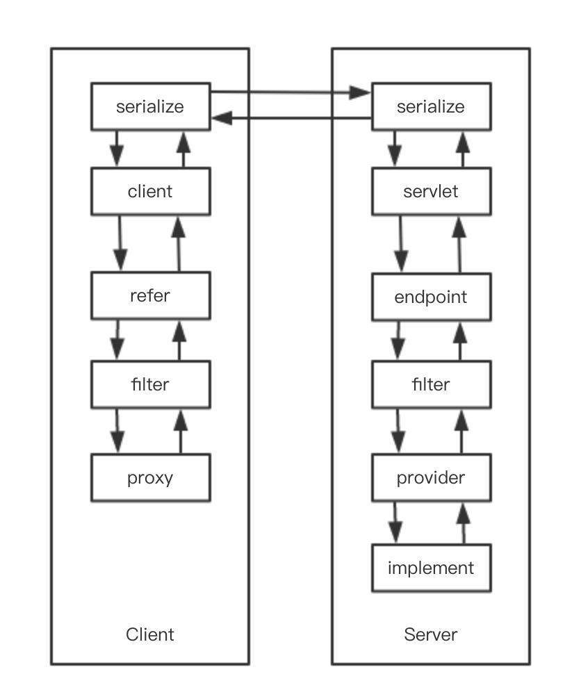

## 架构概述
Raptor中分为服务提供方(RPC Server)，服务调用方(RPC Client)两个角色，以及codegen这个主要插件。

* raptor-codegen 通过 `.proto` 文件生成接口文件；
* Server通过生成的接口的实现类自动生成Servlet，供Client调用；
* Client通过生成的接口自动生成调用代理类，通过代理类直接调用Server提供的服务。

三者的交互关系如下图：

## 模块概述

Raptor框架中主要有client、refer、filter、serialization、provider、endPoint 几个功能模块，各个功能模块都支持通过SPI进行扩展，各模块的交互如下图所示：

#### filter
Filter在调用refer和provider之前调用，可以完成统计、并发控制等功能。

#### refer
持有服务提供方暴露的interface和服务的url，通过调用client和server进行通信。在平常用户使用的时候，refer通常被包装在InvokeHandler中使用。

#### serialize
将RPC请求中的参数、结果等对象进行序列化与反序列化，即进行对象与字节流的互相转换；默认使用protobuf协议。

#### client
Http客户端，通过设置 `serialization` 可以选择 protobuf binary over HTTP 或者 protobuf json over HTTP。

#### provider
提供具体服务实现类的具体方法（Method 对象），供外部调用者调用。

#### endpoint
维护多个provider，负责将provider暴露给web容器。默认实现是endPoint同时作为Servlet，以暴露provider。
