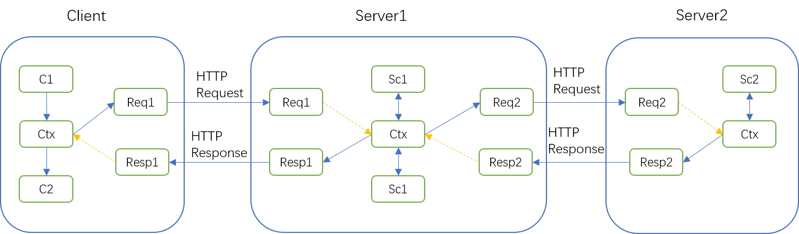

# 自定义HTTP Headers
在Rpc调用时，在传输rpc参数之外，有时还需要传递一些附加信息，比如做请求的染色。

Raptor可以很方便传递用户自定义HTTP Headers。Raptor使用RpcContext保存和传递Rpc上下文信息，通过静态方法`RpcContext.getContext()`获取RpcContext实例，该实例存储在ThreadLocal中。RpcContext实例有如下几个属性：
- `Map<String, String> requestAttachments` 存储请求附加参数，放入HTTP Request Header中向服务端传递
- `Map<String, String> responseAttachments` 存储响应附加参数，放入HTTP Response Header中向客户端传递
- `Request request` Request对象，客户端发起Rpc调用后和服务端调用前设置到RpcContext中
- `Response response` Response，客户端Rpc调用完后和服务端返回前设置到RpcContext中
- `Map<Object, Object> attributes` 本地数据存储，不向后端传递

**Header传递规则**
1. Client将自定义Header写入`RpcContext.requestAttachments`
2. Client Rpc调用前，Raptor将`RpcContext.requestAttachments` 复制到 `Request.Attachments`，
3. Client Rpc调用时，Raptor将`Request.Attachments` 写入HTTP Request Headers
4. Server1接收到HTTP请求时，Raptor复制HTTP Request Headers到`Request.Attachments`
5. Server1完成请求接收后，Raptor复制`Request.Attachments`中以`x-raptortrace-`开头的Header到`RpcContext.requestAttachments`
6. Server1 Rpc实现方法中，可以从`RpcContext.requestAttachments`和`Request.Attachments`中读取自定义Header
7. Server1发起对Server2的Rpc调用与Client对Server1的Rpc调用相同， 结果会将`RpcContext.requestAttachments`中存在Client端传递过来的以`x-raptortrace-`开头的Header，传递到Server2中
8. Server2返回的自定义Header会通过HTTP Response Headers传递给Server1
9. Server1收到Response2，Raptor将`x-raptortrace-`开头的Header，从Response2复制到`RpcContext.responseAttachments`
10. Server1向Client返回Response前，将`RpcContext.responseAttachments`写入`Response.Attachments`，包含Server2返回的自定义Header
11. Client收到Response1，里面包含Server2中自定义的Header




## Client端
### 客户端发送自定义HTTP Request Headers

```
//将自定义Header放入到RpcContex的RequestAttachments中，会作为HTTP header传递给服务端
RpcContext.getContext().putRequestAttachment("x-myheader", "myValue");

//以x-raptortrace-开头的HTTP Header，会传递到服务端的RpcContext中，继续向后传递
RpcContext.getContext().putRequestAttachment("x-raptortrace-myheader", "myTrace");

//proxy为Rpc接口代理
proxy.call(reqMessage);
```

### 客户端读取HTTP Response Headers

```
//proxy为Rpc接口代理
proxy.call(reqMessage);

//从RpcContex读取Response，从Response的Attachments中获取HTTP Response Header
String remoteValue=RpcContext.getContext().getResponse().getAttachments().get("x-myResponse");

//响应头如果以x-raptortrace-开头，可以直接从RpcContext的ResponseAttachments中读取，并且会向后传递
String remoteTrace=RpcContext.getContext().getResponseAttachment("x-raptortrace-myResponse");

```


## Server端

### 服务端读取自定义HTTP Request Headers

```
//Rpc接口实现方法
@Override
public RespMessage service(ReqMessage reqMessage) {

    //从RpcContext中读取Request对象，从Request的Attachments中读取HTTP Request Header
    RpcContext.getContext().getRequest().getAttachments().get("x-myheader");

    //请求头如果以x-raptortrace-开头，可以直接从RpcContext的RequestAttachments中读取
    RpcContext.getContext().getRequestAttachment("x-raptortrace-myheader");

    。。。业务逻辑
    //返回respMessage
    return respMessage;
}
```
### 服务端传递HTTP Response Headers

```
//Rpc接口实现方法
@Override
public RespMessage service(ReqMessage reqMessage) {

    //服务端将自定义的Header放入RpcContext的ResponseAttachments中，Raptor会作为HTTP Response Headers发送给客户端
    RpcContext.getContext().putResponseAttachment("x-myResponse", "myResponse");

    //以x-raptortrace-开头的Header，客户端接收到响应后会设置到RpcContext的ResponseAttachments中向后传递
    RpcContext.getContext().putResponseAttachment("x-raptortrace-myResponse", "myResponse");

    。。。业务逻辑
    //返回respMessage
    return respMessage;
}
```
