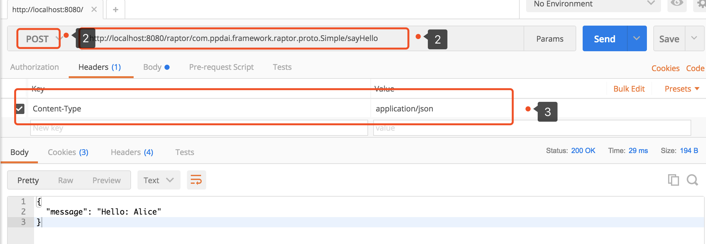
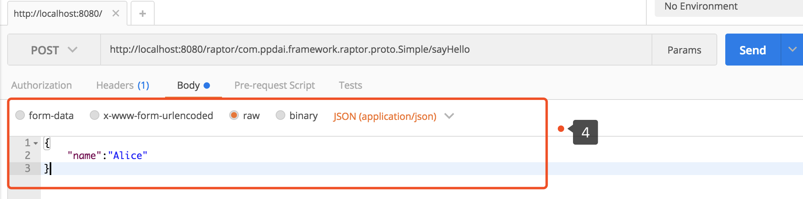

# 路由和序列化原理
序列化和路由由Raptor全权处理。理解Raptor的序列化和路由原理对debugging十分有帮助。

## Http 路由

Raptor使用 HTTP 1.1 作为通讯协议。所有的远程调用方法都被映射到如下形式的路由上：
```
POST /raptor/<package>.<Service>/<method>
```
`<package>` 就是`.proto`文件中定义的package。`<Service>` 就是接口名， `<method>` 是方法名，他们都是驼峰形式的。
> 在代码实现中，我们实际上使用的是Java类的package，Java类的pacakge可以由`java_package`来指定，这就会造成困惑，究竟哪一个“包名”被使用？
>**所以在Raptor中禁止使用`java_package`这个option.** 可以参考[最佳实践]()

例如，`Simple`接口的`sayHello`方法就被映射到如下路由上：
```
POST /raptor/com.ppdai.framework.raptor.proto.Simple/sayHello
```


## Context-type
Http请求中，`Context-type`需要是`application/json`或`application/protobuf`二者之一。Json格式方便调试，其他情况则是使用Protobuf更佳。


## Json 序列化
Json格式符合[Protobuf官方格式](https://developers.google.com/protocol-buffers/docs/proto3#json)。简而言之，所有命名都是首字母小写的驼峰形式。Json中的`null`会被认为默认值，例如，String字段的`null`会被转化成空字符串，数组类型的`null`的则会被转成空List。##


## 错误返回
todo
错误返回的HTTP status 除200以外的值。返回格式如下：

```
POST /raptor/com.ppdai.framework.raptor.proto.Simple/notExistMethod

{
  "timestamp": 1521685873796,
  "status": 500,
  "error": "Internal Server Error",
  "exception": "com.ppdai.framework.raptor.exception.RaptorServiceException",
  "message": "error_message: Can not find method com.ppdai.framework.raptor.proto.Simple/sayHello1, error_code: 10000",
  "path": "/raptor/com.ppdai.framework.raptor.proto.Simple/sayHello1"
}
```


## 使用cURL模拟请求

在命令行手写Raptor请求十分简单。
下面这个例子展示了如何使用cURL请求sayHello方法。

```
curl -X POST \
  http://localhost:8080/raptor/com.ppdai.framework.raptor.proto.Simple/sayHello \
  -H 'content-type: application/json' \
  -d '{	"name":"Alice"}'  \
--verbose
```

我们需要告诉Raptor我们传输的是Json数据，所以我们需要在头部加上 `content-type: application/json`。如果我们使用Protobuf，我们需要将Context-type改成 `application/protobuf`。

`HelloRequest`的Json格式是`{"name":"Alice"}`,和我们定义的Protobuf格式相符合：
```proto
message Size {
   int32 inches = 1;
}
```

Raptor的Json返回如下所示，和我们定义的HelloReply相对应。
```json
{
  "message": "Hello: Alice"
}
```
定义的HelloReplay
```proto
// The response message containing the greetings
message HelloReply {
    string message = 1;
}
```

## 使用Postman模拟请求
使用Postman调用Raptor服务也十分简单。
  1. 输入服务的URL
  2. 选择POST方法
  3. 定义`Content-type`为`application/json`
  4. 定义Json格式的RequestBody



